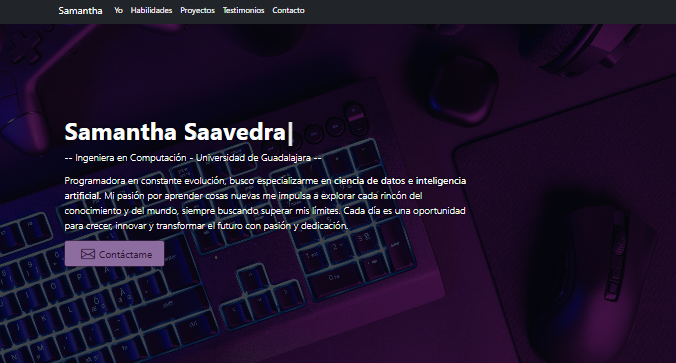
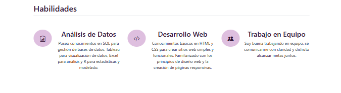
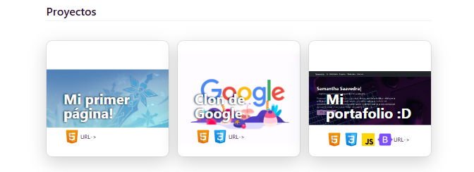
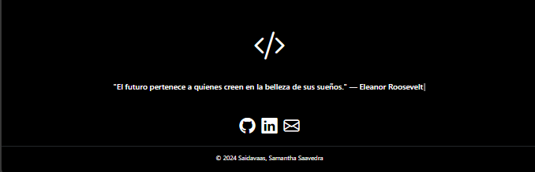

# Mi portafolio de habilidades TECNOLOCHICAS PRO 💜

El presente proyecto es un portafolio desarrollado para poner en práctica las habilidades obtenidad dentro del bootcamp de desarrollo frontend de Technolochicas PRO.
Fue desarrollado con HTML, CSS y JS con el uso de el framework de UI, Bootstrap utilizando además bibliotecas externas.

La página es responsiva (adaptable a diferentes tamaños de pantalla) e incluye la presentación de la autora del proyecto.

[Proyecto desplegado](https://portafolio-samantha-saavedra.netlify.app/)

## Secciones de mi sitio

## Tecnologías 

* HTML
* CSS
* Bootstrap
* JavaScript

---

Desarrollado con amor 💜 por [Saidavaas] en [Technolochicas Pro](https://tecnolochicas.mx/)

